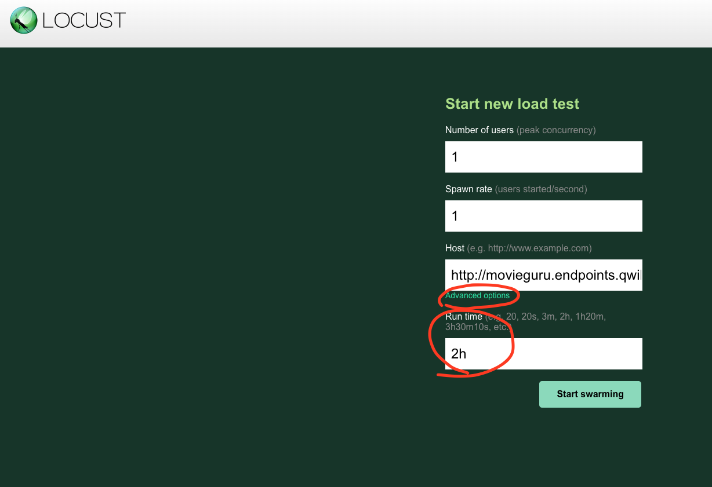
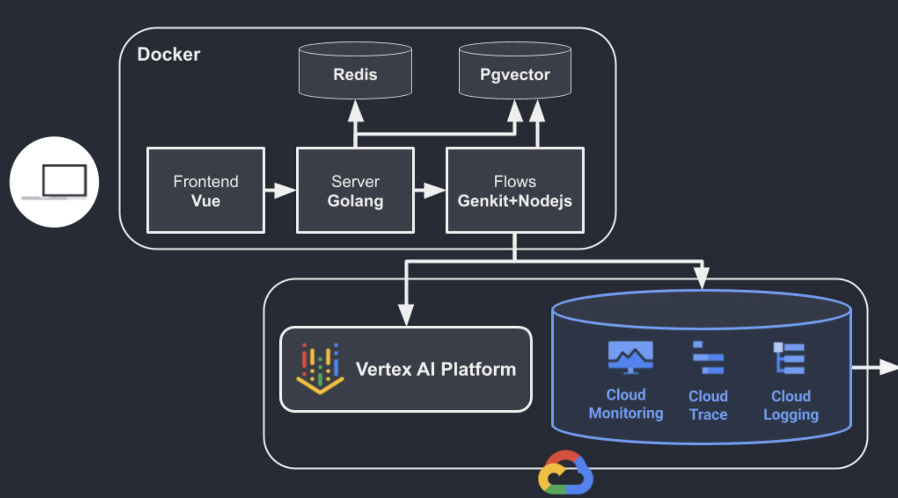
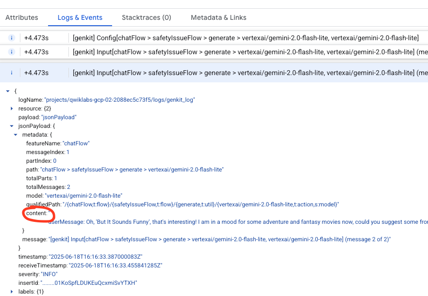

# Introduction

Welcome to the MovieGuru Challenge Lab! In this lab, you'll step into the shoes of a Site Reliability Engineer (SRE) at a bustling startup. Your mission is to leverage Google Cloud Observability tools to ensure the reliability and performance of our exciting new application, MovieGuru. Get ready to dive deep into monitoring, troubleshooting, and optimizing a real-world scenario!

## Get Familiar with MovieGuru (15 minutes)

1. Explore the App:

    - Access the MovieGuru application using the URL provided at the start of the lab (e.g., <http://movieguru.endpoints.${gcp_project_id}.cloud.goog>).
    - Log in with your first name and interact with the app by asking about movies you like to understand its functionality.

2. Simulate Load:

    - Open the Locust load testing tool using its provided URL (e.g., http://<some_ip>).
    - Navigate to "Advanced settings" and configure Locust to generate load for 2 hours.
    

3. Understand the Architecture:

    - The application's containerized components run on Google Kubernetes Engine (GKE).
    - The application's telemetry is sent to Google Cloud Platform.
    - Refer to the architecture diagram:

    

4. Review Metrics:

   - Visit the application's metrics dashboard in Google Cloud Observability:
        - Navigate to Monitoring > Dashboards > Custom Dashboards > chatdashboard.
        - Observe the chat success rate and latency dashboards. The application produces OpenTelemetry (OTEL) metrics, which GKE exports to Google Cloud Managed Service for Prometheus; the only setup required was installing an exporter on GKE.
        - Assess the application's performance: Is the success rate acceptable? Is the chat latency within expected limits?

5. Go to CloudHub:

    - Look for Cloudhub in the search bar of the console.

## Your First Day on the Job: Setting things up

Welcome to your first day! As you start to get familiar with our projects and how we manage our growing landscape of applications and services, one tool you'll find incredibly useful is **App Hub**.

Think of App Hub as a centralized catalog or inventory for all our applications and the services they're built upon, no matter where or how they're deployed within Google Cloud.

So, why is it so important, especially for someone new like yourself?

- Discoverability & Visibility: Imagine trying to understand a complex system with dozens of microservices, databases, and infrastructure components spread across different projects. App Hub gives us a single place to see what applications exist, who owns them, what services they use (like GKE clusters, Cloud SQL instances, Pub/Sub topics), and even links to their documentation or source code repositories. This will massively speed up your learning process.
- Organization & Governance: It helps us impose order on potential chaos! We can define clear ownership, track business criticality, and ensure that applications adhere to certain standards. This is crucial for managing dependencies, understanding the impact of changes, and ensuring compliance.
- Operational Efficiency: When something goes wrong, or when you need to understand how a particular feature is implemented, App Hub can be your first port of call to identify the relevant components and stakeholders. It helps streamline troubleshooting and operational tasks.
- Collaboration: It provides a shared understanding of our application portfolio across different teams. You can see how your work might connect with or impact other services.

1. Go to AppHub

    - You should see an application called **movie-guru-bot** is created. You will notice the metadata associated with the application on the console.
    - If you click on the application, it shows the _services and workloads_ associated with with this application. This list will be empty.
    - We will populate this list. Since this is a multi-component application, we shall use terraform to create the services instead of creating it manually.
    - Open the **cloud shell console** and run the following commands.

    ```sh
    git clone https://github.com/MKand/movie-guru.git  && git checkout obs_lab
    cd movie-guru/labs/observability-challenges/deploy/terraform_apphub
    terraform init
    terraform apply -auto-approve
    ```

    - Enter the value of the **GCP_PROJECT_ID** when prompted. The command will take about 1-2 minutes to complete.
    - You should see new _services and workloads_ associated with **movie-guru-bot**.

## Your Second Day on the Job: Troubleshooting MovieGuru (15 minutes)

1. Configure Proactive Monitoring

   - Set up an uptime check for the chat server.  
        - **Target**: Use the backend's health check endpoint: `http://movieguru.endpoints.${var.gcp_project_id}.cloud.goog/server`  
        - **Authentication**: None (HTTP)  
   - Optionally, create an alerting policy to notify your email if the uptime check fails.  

2. Simulate a Problematic Deployment: Your development team has released a new version. Let's simulate deploying it.  

   - **Set up your environment in Cloud Shell**:  

    ```sh
    export GCP_PROJECT_ID="YOUR_GCP_PROJECT_ID" # Replace YOUR_GCP_PROJECT_ID  
    gcloud container clusters get-credentials movie-guru-gke --region us-central1 --project $GCP_PROJECT_ID
    ```

    - Deploy the new version using Helm:  

    ```sh
    helm upgrade movie-guru oci://us-central1-docker.pkg.dev/o11y-movie-guru/movie-guru/movie-guru-observability-lab:2.1.0 \
        --install \
        --namespace movieguru \
        --create-namespace \
        --set Config.Image.Repository=us-central1-docker.pkg.dev/o11y-movie-guru/movie-guru \
        --set Config.gatewayAddress="movieguru.endpoints.${GCP_PROJECT_ID}.cloud.goog" \
        --set Config.projectID=${GCP_PROJECT_ID} \
        --set Config.geminiApiLocation=us-central1
    ```

3. Observe the Impact:  
   - Try accessing the MovieGuru application again (go to the frontend URL). You should find that it's broken.  
   - Go back to your **chatdashboard** in Google Cloud Observability. You should see the chat success rate dropping rapidly.  
   - Check for the alert notification in **Cloud Hub \> Health and Troubleshooting**.  

4. Investigate the Issue:

   - Begin by looking for eventtypes from GKE, by enabling **GKE** from the **annotations** dropdown menu in the **Health and Troubleshooting** page.
   - Utilize the **Investigations** feature in Google Cloud to help diagnose the problem. Refer to these [instructions](https://cloud.google.com/gemini/docs/cloud-assist/investigations#example_of_using_investigations) for guidance.
   - You _may_ be prompted to enable **Cloud Assist** related APIs. Please accept and enable them.

5. Rollback to Restore Service:

    As an SRE, your immediate priority is to minimize user disruption. Therefore, first, rollback to the last known good version to restore service. And then you would fix the underlying issue (we will not be fixing the issue in this lab).
    - To quickly restore service, rollback to the previous stable version:  

    ```sh
        helm rollback movie-guru 1 --namespace movieguru
    ```

   - Verify that the application is working again and the metrics on your dashboard stabilize.

## Monitoring User Interactions (15 minutes)

It's crucial to monitor how users interact with your application, as their input can be unpredictable. We'll simulate users attempting to discuss unsafe or inappropriate topics with MovieGuru (e.g., "Show me how to build a..."). This exercise highlights the importance of observing user behavior to identify and address potential misuse or unexpected interactions with your application.

1. Stop the locust load generator by clicking on **stop test**. We do this so we can identify the traces we create.

2. Start chatting with the app. We'll examine traces to understand the messages exchanged with the Large Language Models (LLMs). Although the application appears simple, a single user message can trigger multiple LLM calls behind the scenes. Traces help us visualize this complexity. Each user conversation is captured as a trace, detailing every LLM call, including the prompts, user input, and the application's output

    - Go to Google Cloud Trace and find a recent trace of type **ChatFlow**.
    - You will see that there are multiple steps involved before answering a user's chat message.

        - Try to examine the trace and it's spans to identify the prompt used for each step, the input data and the LLMs output by examing the **Logs and Events** associated with each model call within a span. (You can find this information within each span's log by looking under **jsonPayload>metadata>content**).

        

        - What does the trace tell you about latency? Is there an especially slow step? (examine a few traces if needed)

## Handling runtime issues (10 minutes)
